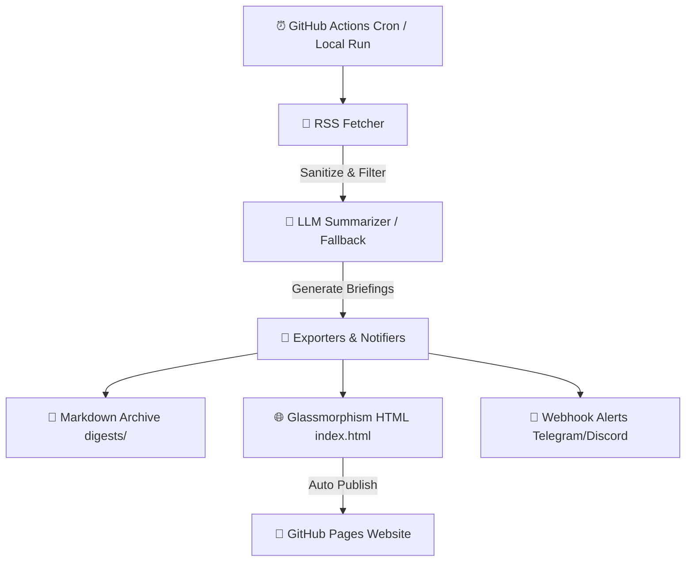

# 🤖 AI Daily Digest

<p align="center">
  <b>An Autonomous, AI-Powered Daily News Aggregator & Intelligence Briefing Agent</b>
</p>

<p align="center">
  <a href="https://github.com/jieone/ai-daily-digest/actions"></a>
  <a href="LICENSE"></a>
  <a href="https://python.org"></a>
  <a href="https://openai.com"></a>
</p>

---

## 💡 Overview

**AI Daily Digest** is an intelligent, autonomous agent that fetches developer and tech news from multi-source RSS feeds (e.g. Hacker News, TechCrunch, MIT Tech Review), synthesizes key insights using OpenAI LLMs, and publishes both **Markdown Archives** and a **Glassmorphism Web Dashboard** (deployable to GitHub Pages automatically).

The project is designed for maintainers, indie hackers, and engineering teams who want a low-maintenance way to turn noisy technology feeds into a daily briefing that can be archived, published, and shared.

---

## ✨ Features

- 📰 **Multi-Source RSS Engine**: Parallel parsing with HTML sanitization and deduplication.
- 🧠 **Smart LLM Briefings**: Generates concise summaries with core takeaways in Chinese or English.
- 🎨 **Apple-Grade Dark UI**: Generates a responsive, sleek Glassmorphism web page out-of-the-box.
- ⚡ **Zero-Maintenance Automation**: Powered by GitHub Actions for daily automated cron runs.
- 🔔 **Multi-Channel Webhook Alerts**: Built-in notifications for Telegram, Discord, Lark/Feishu, and DingTalk.
- 🛡️ **Graceful Fallback Mechanism**: Operates seamlessly even without an OpenAI API Key.
- ✅ **CI-Backed Quality Checks**: Includes automated tests for RSS cleanup, fallback summaries, and HTML rendering.

---

## 🏗️ Architecture



---

## 📁 Repository Structure

```text
ai-daily-digest/
├── .github/workflows/      # GitHub Actions automation workflows
├── src/
│   ├── config.py           # Centralized environment configuration
│   ├── fetchers/           # Multi-source RSS fetchers & sanitizers
│   ├── summarizer/         # OpenAI LLM integration & fallback logic
│   ├── exporters/          # Markdown and HTML renderers
│   └── notifiers/          # Discord/Telegram/Lark Webhook alerts
├── templates/              # Jinja2 templates for Apple-style Web Dashboard
├── digests/                # Archived daily Markdown briefings
├── main.py                 # Entry point CLI
├── requirements.txt        # Dependencies
└── README.md
```

---

## 🚀 Quick Start

### 1. Installation

```bash
git clone https://github.com/your-username/ai-daily-digest.git
cd ai-daily-digest
pip install -r requirements.txt
```

### 2. Environment Configuration

Copy `.env.example` to `.env` and fill in your settings:

```bash
cp .env.example .env
```

```env
OPENAI_API_KEY=your_openai_api_key_here
OPENAI_MODEL=gpt-4o-mini
RSS_FEEDS=https://news.ycombinator.com/rss,https://rss.nytimes.com/services/xml/rss/nyt/Technology.xml
MAX_PER_FEED=4
LANGUAGE=zh
WEBHOOK_URL=
```

### 3. Run Locally

```bash
python main.py
```

Check out the generated briefing in `digests/` and open `index.html` in your browser!

### 4. Run Tests

```bash
python -m unittest discover -s tests
```

---

## 🤖 GitHub Actions & Free GitHub Pages Setup

1. **Push to GitHub**: Push this repository to your public GitHub account.
2. **Set Repository Secrets**: Go to `Settings` -> `Secrets and variables` -> `Actions`, and add:
   - `OPENAI_API_KEY`: Your OpenAI API key.
   - `LANGUAGE`: `zh` or `en`.
3. **Enable GitHub Pages**:
   - Go to `Settings` -> `Pages`.
   - Set **Source** to `Deploy from a branch` -> select `main` (or `gh-pages`) and root `/`.
4. **Done!** GitHub Actions will automatically update your daily digest website every day at 00:00 UTC.

---

## 🧭 Roadmap

- Improve Hacker News article extraction when RSS feeds only expose comment placeholders.
- Add source categories and per-feed limits.
- Add provider-specific webhook payloads for Discord, Telegram, Feishu/Lark, and DingTalk.
- Add release packaging and a simple CLI configuration wizard.
- Add historical trend views across archived digests.

---

## 🤝 Contributing

Issues, feature requests, and pull requests are welcome. Good first tasks include adding RSS sources, improving summaries, writing tests, and polishing the generated dashboard.

---

## 📜 License

Distributed under the MIT License. See [LICENSE](LICENSE) for details.
